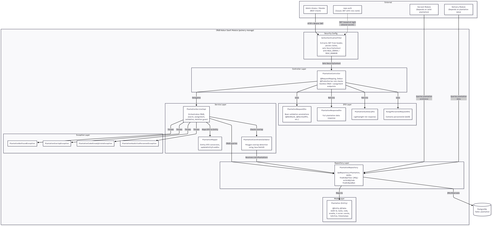
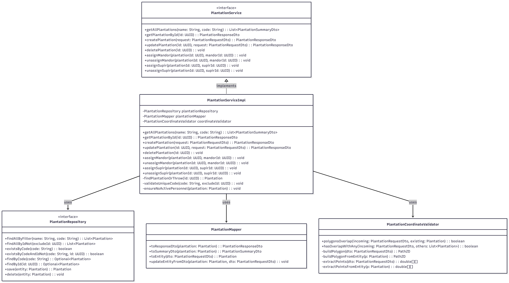
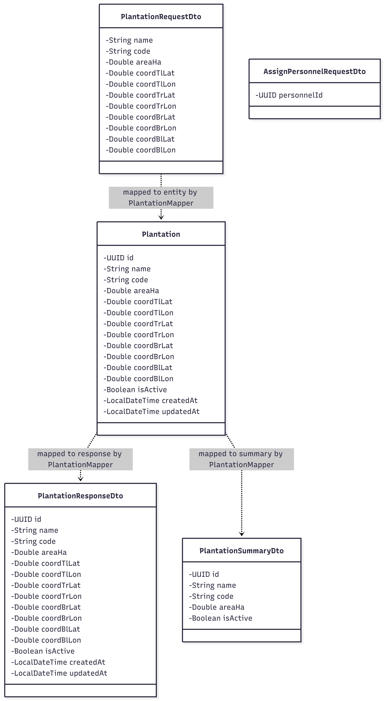

# Maira Azma Shaliha (2406408086) - CRUD Kebun Sawit

## Component Diagram (C4 Level 3)

## Code Diagrams (C4 Level 4)

### Class Diagram: PlantationServiceImpl

### Class Diagram: Plantation Entity & DTOs

### Sequence Diagram: Create Plantation

### Sequence Diagram: Delete Plantation

---

### Module Integration with Other Modules

The CRUD Kebun Sawit module supports the broader Palmery system by:
- Providing plantation existence validation that the Harvest module depends on (harvests can only happen in valid plantations).
- Providing plantation and assignment data that the Delivery module depends on for scheduling.
- Enforcing data integrity (unique codes, no overlapping areas, no deletion of active plantations) that protects downstream modules from operating on invalid state.
