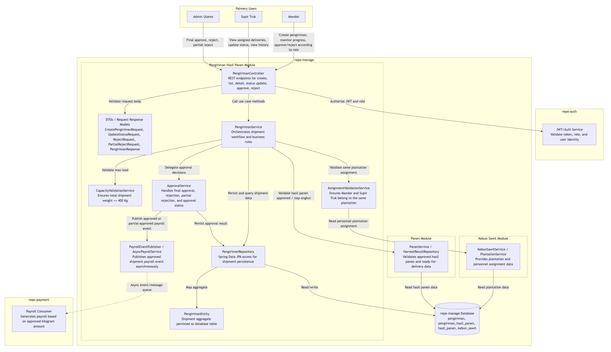
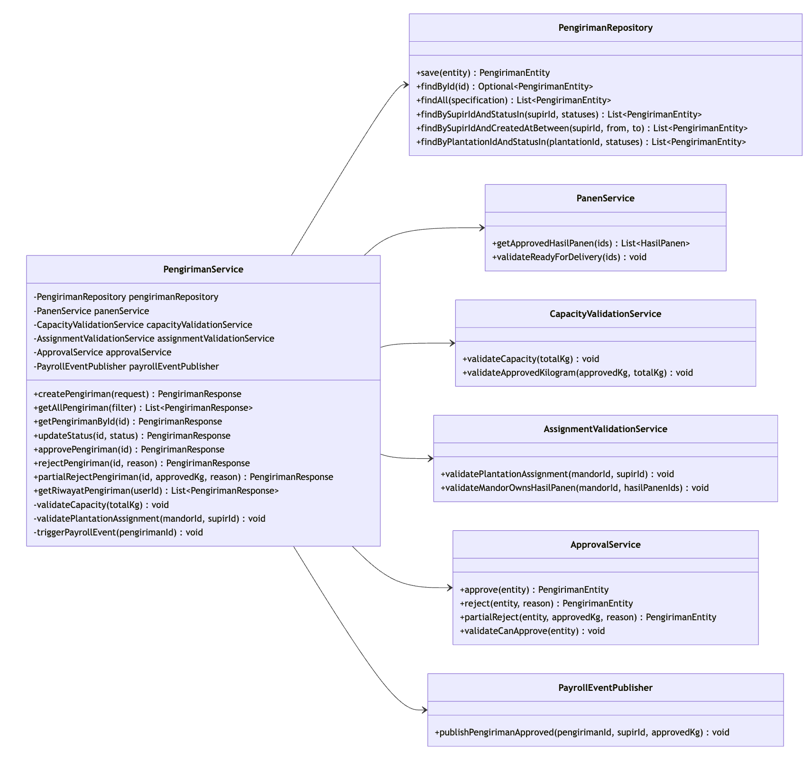
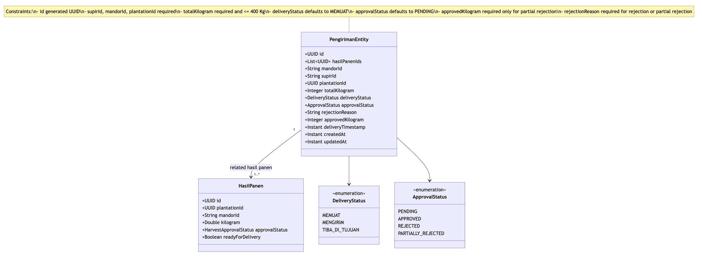
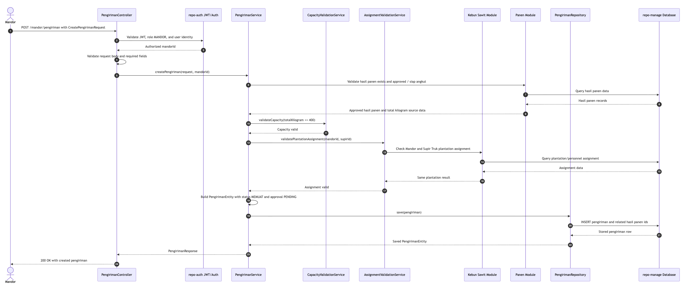
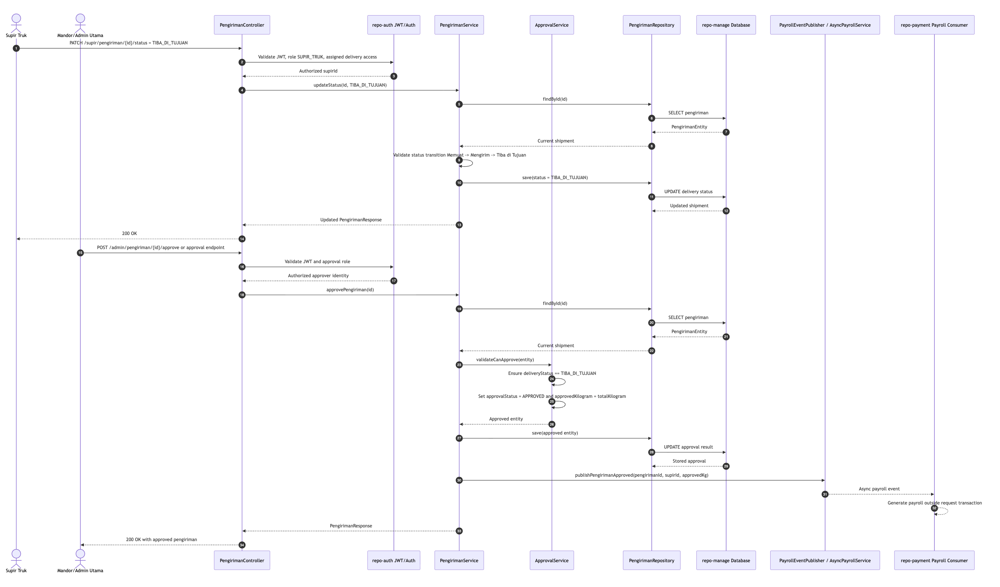
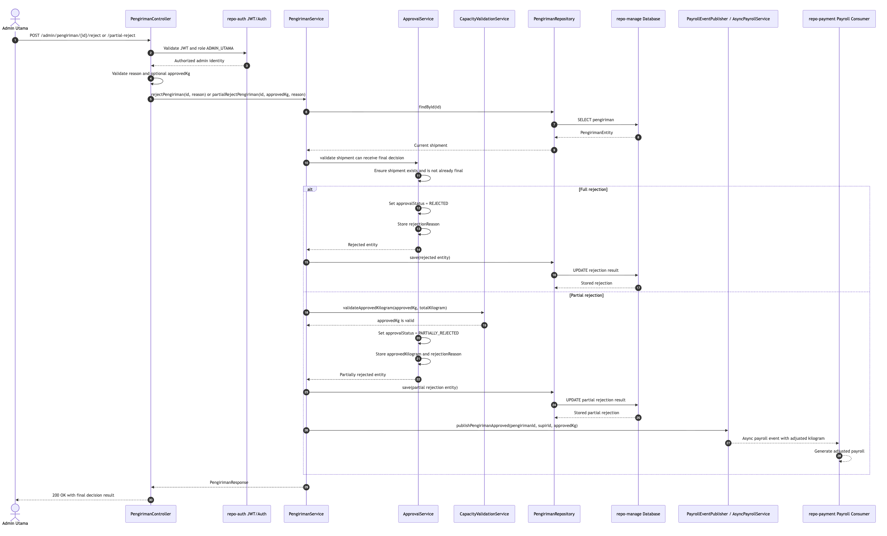

## I Gusti Ngurah Agung Airlangga Putra (2406358794) : Pengiriman Kebun Sawit

## 1. Component Diagram (C4 Level 3)

The Pengiriman module provides REST APIs through `PengirimanController`, while the main workflow is handled by `PengirimanService`. More specific rules, such as validation and approval, are separated into their own components. Shipment data is stored in the `repo-manage` database through `PengirimanRepository`. For security, authentication and role validation are connected to `repo-auth`, while payroll generation is sent asynchronously to `repo-payment` after Admin Utama approves or partially approves a delivery.

## 2a. Code Diagram: PengirimanService

`PengirimanService` works as the main application service for the Pengiriman module. It coordinates CRUD operations, filtering, status updates, validation, approval or rejection, and asynchronous payroll triggering. However, it should not be responsible for every rule directly. In the current codebase, this responsibility is implemented by `DeliveryService`, where most validation and approval logic is still placed inside the service. The diagram shows the intended structure so the module has a cleaner and more maintainable boundary.

## 2b. Code Diagram: PengirimanEntity

`PengirimanEntity` represents the shipment data that is stored in the database. It keeps information about the assigned Supir Truk, assigned Mandor, related hasil panen, total shipment kilogram, delivery progress, approval result, rejection details, and audit timestamps. In the current implementation, this is mapped to `Delivery`, `DeliveryStatus`, and the `delivery_panen_ids` element collection.

## 2c. Sequence Diagram: Create Pengiriman Flow

The create flow begins when a Mandor creates a delivery request. The system then checks authorization, request data, hasil panen eligibility, truck load capacity, and whether the Mandor and Supir Truk are assigned to the same plantation. After all checks pass, the delivery is saved. The default delivery status is `Memuat`, so the shipment can immediately appear as an active delivery for the assigned Supir Truk.

## 2d. Sequence Diagram: Approve Pengiriman Flow

Approval can only be done after the shipment status reaches `Tiba di Tujuan`. When the delivery is approved, the module publishes a payroll event and returns the response without waiting for the payroll calculation to finish.

## 2e. Sequence Diagram: Reject / Partial Reject Pengiriman Flow

A full rejection saves the rejection reason and does not trigger payroll. A partial rejection saves both the rejection reason and the approved kilogram amount, then triggers payroll only for the kilogram amount that is accepted.

## Design Decisions

- `PengirimanController` only handles HTTP-related concerns, such as route mapping, request validation, response mapping, and passing the request to the service layer.
- `PengirimanService` acts as the workflow coordinator for the module. As the module grows, it should not contain every validation rule directly.
- `PengirimanRepository` handles database access so persistence logic does not leak into the controller or service workflow.
- `PengirimanEntity` represents the shipment aggregate and stores the current operational state of a delivery.
- `ApprovalStatus` is separated from `DeliveryStatus` so physical shipment progress is not mixed with approval decisions.
- The pengiriman stores several final decisions as `DeliveryStatus` values, such as `APPROVED_ADMIN`, `REJECTED_ADMIN`, and `PARTIAL_REJECTED_ADMIN`. In the target architecture, separating `deliveryStatus` and `approvalStatus` makes the model easier to understand and maintain.

## Separation of Concerns

- Controller layer: API boundary, JWT principal extraction, request models, and response models.
- Service layer: use case coordination for create, list, detail, status update, approval, rejection, and history.
- Validation layer: reusable business rules that can be tested separately.
- Approval layer: final decision logic for approval, rejection, and partial rejection.
- Repository layer: JPA queries and database persistence.
- Event integration layer: asynchronous payroll event publishing without directly coupling Pengiriman to the payroll implementation.

## Asynchronous Payroll Integration

Payroll generation is handled by `repo-payment`, not `repo-manage`. After Admin Utama approves or partially approves a delivery, `PayrollEventPublisher` publishes an event containing the `pengirimanId`, `supirId`, `mandorId`, total kilogram, approved kilogram, and timestamp. `repo-payment` then consumes the event asynchronously and creates the payroll outside the main request-response flow. This keeps the approval process fast, prevents payment-related issues from blocking shipment approval, and allows retry handling to be managed by the payment system.

## Why CapacityValidationService and AssignmentValidationService Are Separated

`CapacityValidationService` is responsible for weight-related rules, especially the 400 Kg truck load limit and partial approval kilogram boundaries. These rules are numeric and directly related to the shipment itself.

`AssignmentValidationService` is responsible for checking personnel and plantation consistency. It makes sure that the Mandor and Supir Truk belong to the same Kebun Sawit and that the Mandor is allowed to assign the selected hasil panen. Since this rule depends on plantation and user assignment data, it should be separated from capacity validation.

By separating these validators, each component stays smaller, easier to test, and reusable in different flows such as creating a delivery, reassignment, and partial approval.

## Why Approval Logic Is Separated From Shipment Status Management

Shipment status describes the physical movement of the delivery: `Memuat`, `Mengirim`, and `Tiba di Tujuan`. Approval status describes the business decision: pending, approved, rejected, or partially rejected. These two things change for different reasons and are handled by different roles.

Keeping approval logic inside `ApprovalService` prevents final business decisions from being mixed with Supir Truk status updates. It also makes the rule that a delivery cannot be approved before reaching `Tiba di Tujuan` clearer and easier to test.