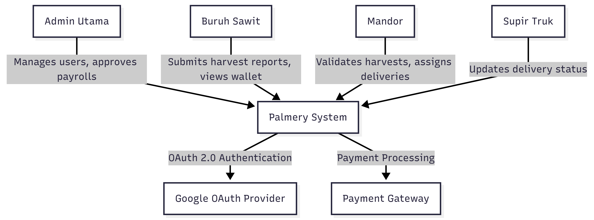
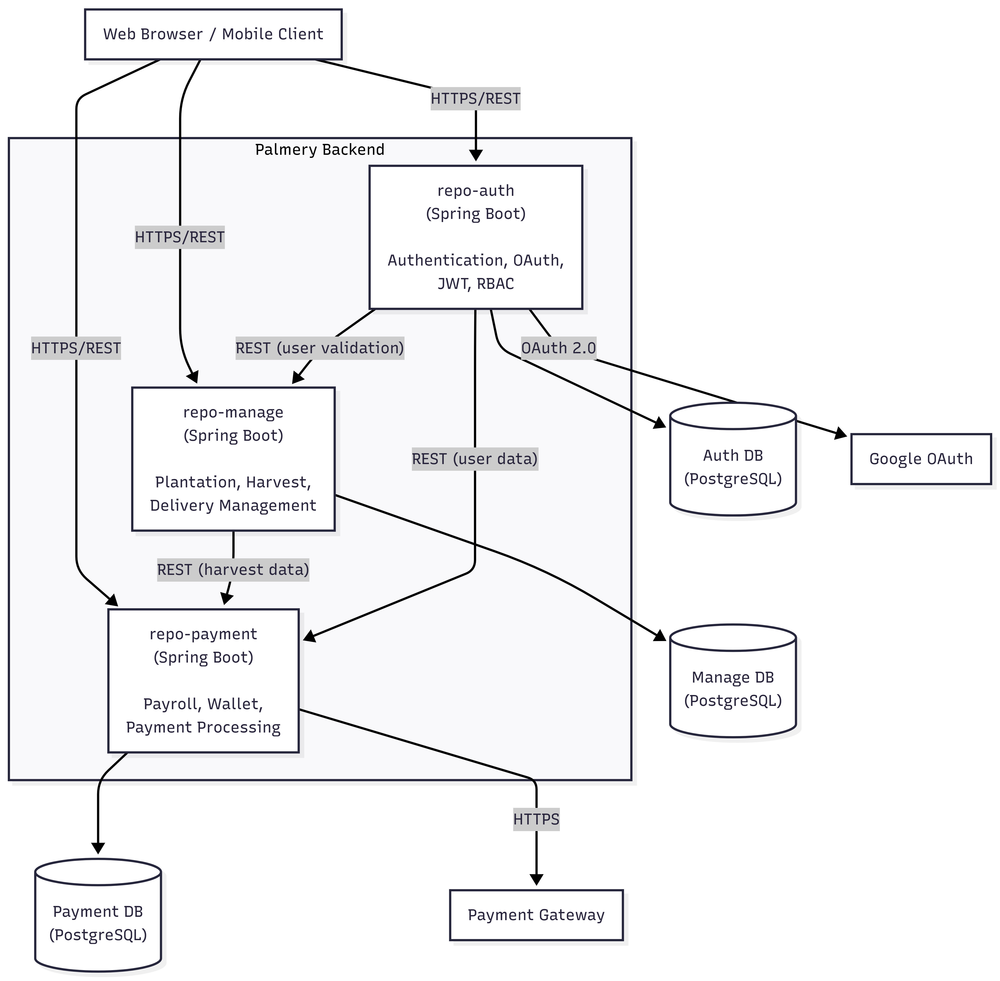
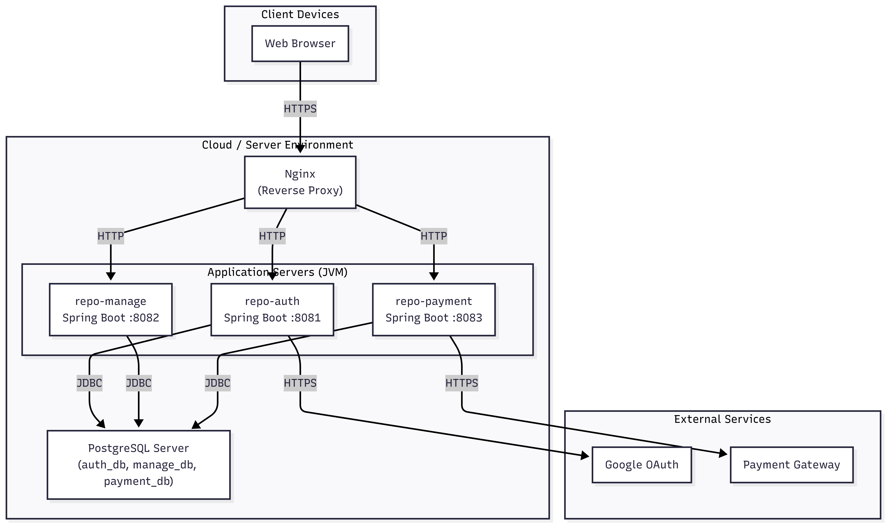
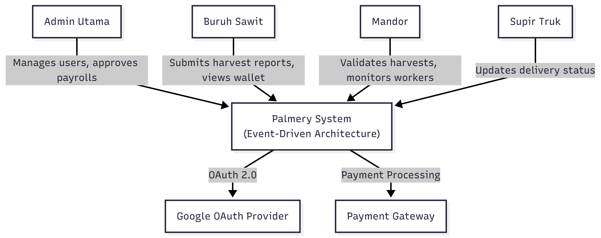
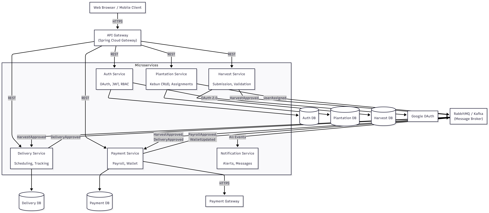

# Palmery - Tutorial 9

### System Context Diagram (C4 Level 1)

### Container Diagram (C4 Level 2)

### Deployment Diagram

---

### Risk Storming Summary

| No | Risk | Impact | Mitigation |
|---|------|--------|------------|
| 1 | Synchronous cascading failures between services | System-wide outage | Circuit breakers, async communication |
| 2 | Database contention from shared DB server | Slow queries, timeouts | Database per service, read replicas |
| 3 | Harvest traffic spikes from concurrent worker submissions | Service overwhelmed, timeouts | Message queue buffering, horizontal scaling |
| 4 | Monthly payroll batch processing blocks other operations | System unresponsive | Async event-driven payroll generation |
| 5 | Tight coupling requires coordinated deployments | Slow feature delivery | Event-based communication, independent deployments |
| 6 | No API Gateway for centralized rate limiting or routing | Security gaps, inconsistent auth | Introduce API Gateway |
| 7 | Auth service is a single point of failure for all services | Total platform inaccessibility | JWT local validation, service redundancy |
| 8 | No distributed tracing makes debugging difficult | Slow incident response | Centralized logging, tracing tools |

### Future Context Diagram (After EDA Migration)

### Future Container Diagram (EDA with Message Broker)
