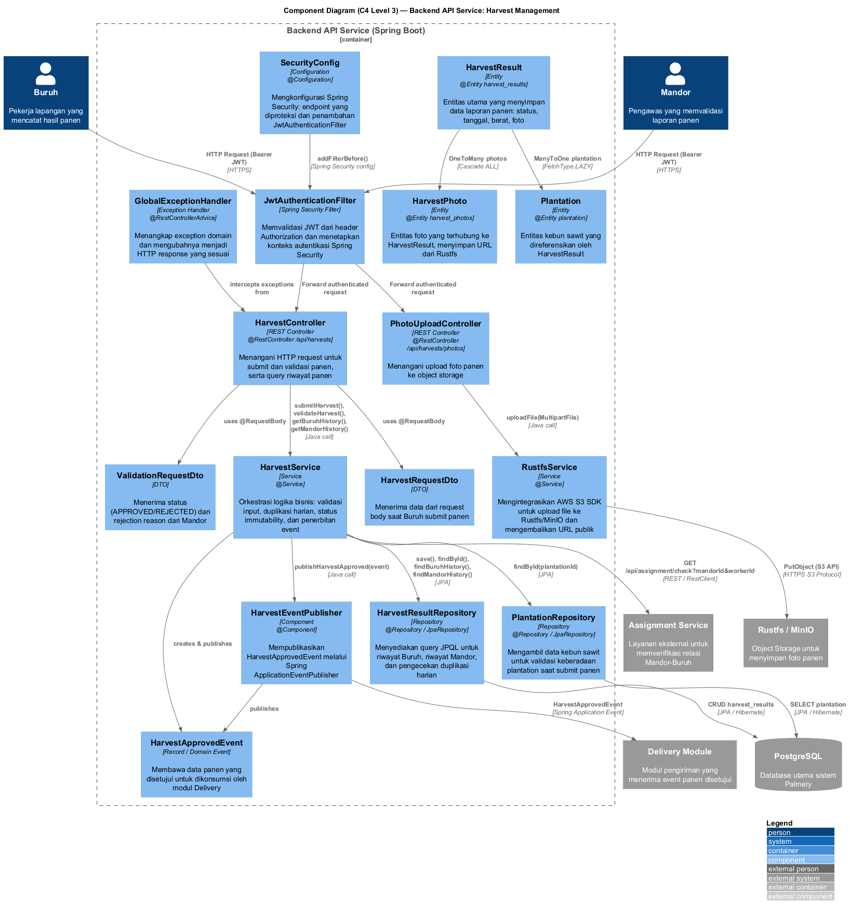
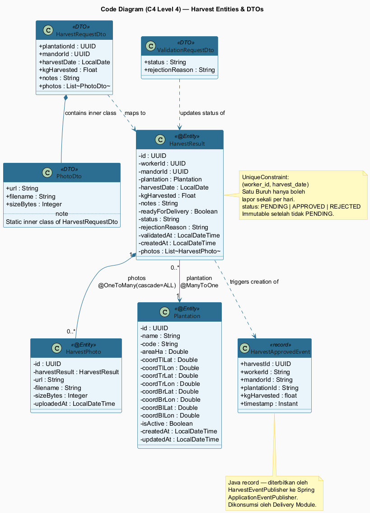
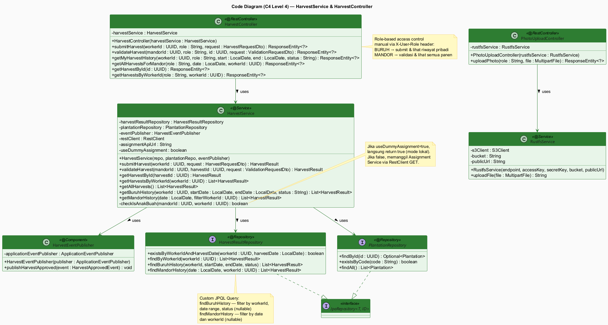
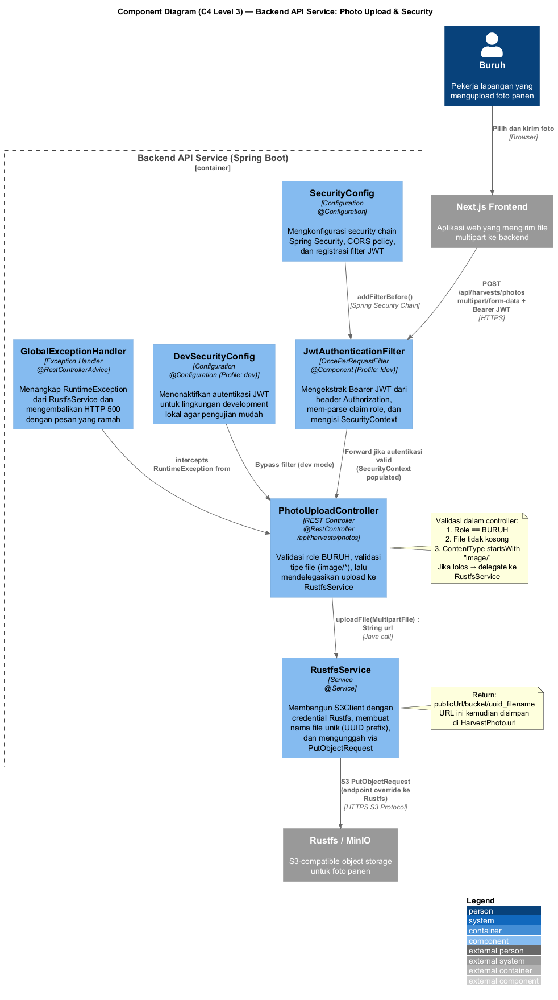

# Alya Nabilla Khamil — Harvest Management (feat/harvest-management)

## Component Diagram (C4 Level 3) — Backend API Service: Harvest Management

Diagram ini menggambarkan seluruh komponen internal Backend API Service yang terlibat dalam fitur **manajemen hasil panen (harvest management)**.

### Penjelasan

1. **HarvestController** menerima HTTP request dari Buruh (submit panen) dan Mandor (validasi panen). Controller ini memverifikasi role dari header `X-User-Role` secara manual sebelum mendelegasikan ke `HarvestService`.
2. **HarvestService** adalah jantung logika bisnis: memvalidasi input, memeriksa duplikasi laporan harian (satu Buruh satu kali per hari), memverifikasi keberadaan plantation, memperbarui status (`PENDING → APPROVED/REJECTED`), dan mempublikasikan `HarvestApprovedEvent` jika panen disetujui.
3. **HarvestResultRepository** menyediakan custom JPQL queries untuk mendukung filter riwayat berdasarkan workerId, rentang tanggal, dan status — memisahkan kebutuhan query Buruh (riwayat pribadi) dan Mandor (semua panen).
4. **HarvestEventPublisher** mempublikasikan Spring Application Event (`HarvestApprovedEvent`) agar Delivery Module dapat bereaksi tanpa coupling langsung ke Harvest module.
5. **JwtAuthenticationFilter** memvalidasi JWT dari header `Authorization` dan mengisi `SecurityContext`, sehingga semua komponen hilir dapat beroperasi dalam konteks autentikasi yang aman.

---

## Code Diagrams (C4 Level 4)

### Class Diagram 1: Harvest Entities & DTOs

Diagram ini menggambarkan struktur data inti modul harvest: entitas JPA, DTO, dan domain event.

#### Penjelasan

1. **HarvestResult** adalah entitas utama dengan constraint unik `(worker_id, harvest_date)` yang memastikan seorang Buruh hanya bisa melaporkan panen sekali per hari. Field `status` bersifat immutable setelah tidak `PENDING` (dijaga di layer service).
2. **HarvestPhoto** berelasi `@OneToMany` ke `HarvestResult` dengan `cascade=ALL` dan `orphanRemoval=true`, menjamin integritas referensial — foto ikut terhapus jika HarvestResult dihapus. URL foto disimpan dari Rustfs object storage.
3. **HarvestRequestDto** membungkus data input dari Buruh termasuk nested `PhotoDto` (inner static class) yang memetakan URL foto dari Rustfs ke dalam entitas `HarvestPhoto`.
4. **HarvestApprovedEvent** adalah Java `record` yang berfungsi sebagai domain event immutable — dipublikasikan ke `Spring ApplicationEventPublisher` saat status panen berubah menjadi `APPROVED`, lalu dikonsumsi oleh Delivery Module.
5. Desain ini memisahkan kepentingan antara persistence (entity), transport (DTO), dan inter-module communication (event), sesuai prinsip Clean Architecture.

---

### Class Diagram 2: HarvestService & HarvestController

Diagram ini menggambarkan layer Controller dan Service beserta dependensinya.

#### Penjelasan

1. **HarvestController** bersifat tipis (*thin controller*): hanya menangani HTTP concern (routing, status code, validasi role dari header), lalu meneruskan ke `HarvestService`. Ini memudahkan unit testing tanpa HTTP context.
2. **HarvestService** mengimplementasikan dua jalur utama: `submitHarvest()` yang membangun entitas dari DTO dan menyimpannya, serta `validateHarvest()` yang menerapkan state machine sederhana (hanya PENDING yang bisa diubah) dan memanggil `checkIsAnakBuah()` untuk memverifikasi relasi Mandor-Buruh.
3. **`checkIsAnakBuah()`** menggunakan toggling via `@Value("${assignment.api.dummy:true}")`: ketika `true` (mode dev) langsung return `true` tanpa memanggil API eksternal, ketika `false` melakukan HTTP GET ke Assignment Service via `RestClient` — memungkinkan pengembangan tanpa dependency pada modul lain.
4. **RustfsService** mengabstraksikan AWS S3 SDK untuk berkomunikasi dengan Rustfs (S3-compatible object storage), menghasilkan filename unik berbasis UUID untuk menghindari collision.
5. **HarvestResultRepository** mewarisi `JpaRepository` dan menambahkan dua custom JPQL query: `findBuruhHistory` (mendukung filter nullable date range + status) dan `findMandorHistory` (filter nullable date + workerId) — kedua query memanfaatkan JPQL `CAST(:param as type) IS NULL` untuk mengakomodasi optional parameters.

---

## Bonus: Component Diagram (C4 Level 3) — Photo Upload & Security

Diagram ini menggambarkan komponen yang terlibat dalam alur upload foto panen dan konfigurasi keamanan.

### Penjelasan

1. **PhotoUploadController** adalah endpoint khusus foto di `/api/harvests/photos` yang melakukan tiga validasi berlapis sebelum upload: verifikasi role `BURUH`, pengecekan file tidak kosong, dan validasi MIME type harus `image/*` — semua di layer controller sebelum mencapai service.
2. **RustfsService** membangun `S3Client` dengan endpoint override ke Rustfs (bukan AWS), memungkinkan penggunaan infrastruktur object storage self-hosted yang S3-compatible. File diupload dengan prefix UUID untuk keunikan nama.
3. **JwtAuthenticationFilter** (hanya aktif di profile `!dev`) mem-parse JWT, mengekstrak claim `role` dan `subject`, lalu mengisi `SecurityContext`. Di profile `dev`, **DevSecurityConfig** menggantikan behavior ini dengan mengizinkan semua request tanpa autentikasi — mendukung kemudahan pengembangan lokal.
4. **SecurityConfig** mengatur security chain termasuk CORS policy dan meregistrasi `JwtAuthenticationFilter` sebelum `UsernamePasswordAuthenticationFilter` agar JWT divalidasi lebih awal di pipeline.
5. Desain dual-profile (`dev`/`prod`) ini merupakan trade-off yang disengaja antara developer experience (mudah test lokal) dan production security (JWT wajib), mengikuti pola Spring Boot profiles yang umum digunakan.

---

## Design Decision Notes

### Role-Based Access Control via Headers

Sistem menggunakan header `X-User-Id` dan `X-User-Role` yang dikirim bersama setiap request (setelah JWT divalidasi oleh API Gateway/Filter). Validasi role dilakukan secara manual di controller (`equalsIgnoreCase`) karena role bersifat domain-specific (BURUH/MANDOR) dan lebih fleksibel daripada menggunakan `@PreAuthorize` Spring Security untuk kasus ini.

### Harvest Status Immutability

`HarvestService.validateHarvest()` memeriksa `!PENDING.equals(harvest.getStatus())` sebelum memperbarui status. Ini mencegah double-validation atau manipulasi status yang sudah final — menerapkan prinsip data immutability pada laporan yang sudah diproses.

### Event-Driven Integration dengan Delivery Module

Daripada memanggil Delivery Service secara langsung (tight coupling), modul Harvest mempublikasikan `HarvestApprovedEvent` ke Spring `ApplicationEventPublisher`. Delivery Module dapat listen event ini secara independen. Ini memungkinkan setiap modul berkembang secara terpisah tanpa breaking changes.

### Dummy/Mock Mode untuk Inter-Service Call

Assignment Service call di `checkIsAnakBuah()` di-toggle via property `assignment.api.dummy`. Default `true` agar pengembangan dan testing tidak bergantung pada service lain berjalan. Di lingkungan staging/production, nilai diubah ke `false` untuk mengaktifkan validasi nyata.
