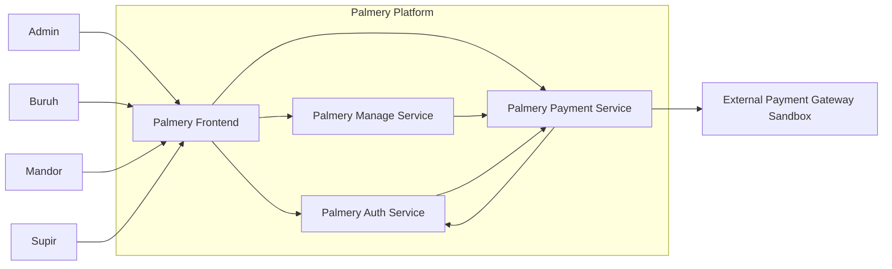
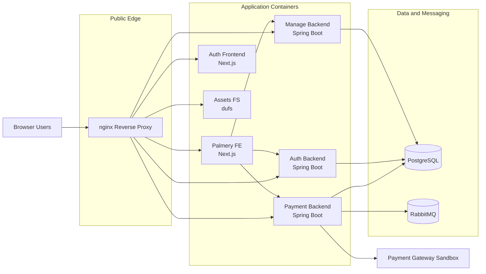
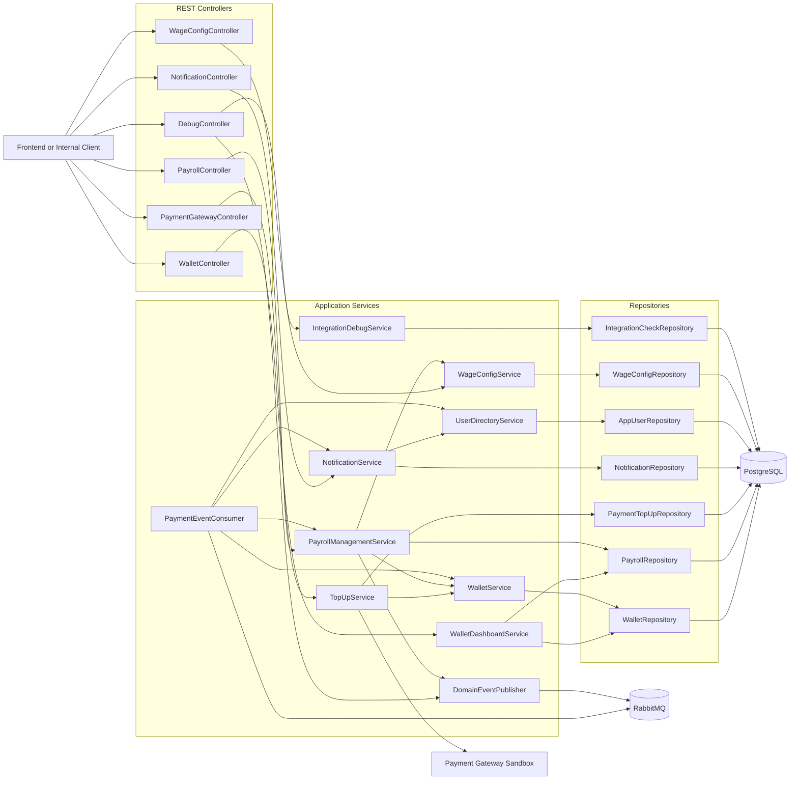
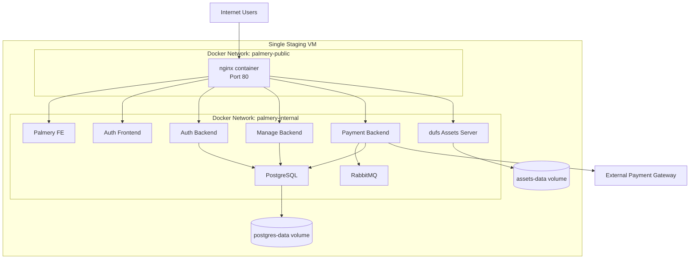

# Palmery Payment and Infrastructure - Individual (Vincent)

This document captures the architecture deliverable for the Palmery payment domain and the current deployment infrastructure.

## 1. System Context Diagram

### Context Notes

- All four user roles access Palmery through the main frontend.
- `palmery-payment` is responsible for wallet balance, payroll records, notifications, wage configuration, and top-up processing.
- `palmery-payment` integrates with a sandbox payment gateway for admin top-up flows.
- `palmery-auth` and `palmery-manage` exchange data indirectly with payment through API calls and domain events.

## 2. Container Diagram

### Container Notes

- `nginx` is the only public ingress and routes by domain to the correct container.
- `palmery-payment` persists wallet, payroll, notification, user-directory, and top-up data in PostgreSQL.
- RabbitMQ is used for payment-side asynchronous integration, especially payroll and notification processing after domain events.
- The current infra still uses one shared PostgreSQL instance with separate logical databases.

## 3. Component Diagram for `palmery-payment`

### Component Notes

- `PaymentGatewayController` and `TopUpService` implement the admin top-up flow and webhook confirmation.
- `PayrollManagementService` creates payroll drafts, approves or rejects payroll, and emits `PayrollDiproses` domain events.
- `PaymentEventConsumer` listens to RabbitMQ and turns upstream operational events into wallet initialization, payroll creation, and user notifications.
- `NotificationService` and `UserDirectoryService` keep user-targeted notifications inside the payment domain instead of reaching back into auth synchronously for each request.

## 4. Deployment Diagram

### Deployment Notes

- The current deployment is a single-VM compose stack, so reliability depends heavily on that host.
- `palmery-public` exposes only `nginx`, all application containers and data services remain on `palmery-internal`.
- PostgreSQL and asset storage use Docker volumes for persistence.
- RabbitMQ is an internal-only integration backbone for the payment workflow.

## 5. Risk Summary

| Risk | Impact | Mitigation |
|---|---|---|
| Shared PostgreSQL instance for multiple services | Resource contention or noisy-neighbor failures across domains | Move toward stronger database isolation and backup strategy per service |
| Single staging VM | One host outage removes the full platform | Replicate environment or separate critical services |
| `nginx` as single ingress point | Misconfiguration or outage blocks all public access | Harden config, add health checks, consider redundant edge deployment |
| Payment webhook handled inside one service instance | Missed confirmations can leave top-ups pending | Add retry-safe webhook handling and monitoring |
| Event consumer coupled to one queue | Queue backlog delays payroll and notifications | Monitor queue depth and scale consumer instances |

## 6. Architecture Justification

The current payment-and-infra architecture is already aligned with Palmery’s most important flows, wallet funding, payroll generation, and internal notifications. The strongest design choice in this scope is the combination of synchronous API endpoints for interactive user actions and asynchronous RabbitMQ consumers for operational events. That split keeps top-up and wallet screens responsive while allowing payroll generation and notification fan-out to run independently of the upstream transaction that produced the event.

The main weakness is infrastructure centralization. `palmery-infra` currently deploys the entire platform on one compose stack with one shared PostgreSQL host and one public reverse proxy. This is acceptable only for staging and milestone delivery, but it becomes the limiting factor for fault isolation and scale. For the next evolution, we will do deployment isolation, observability, and database separation around the existing payment service and whole palmery service.
